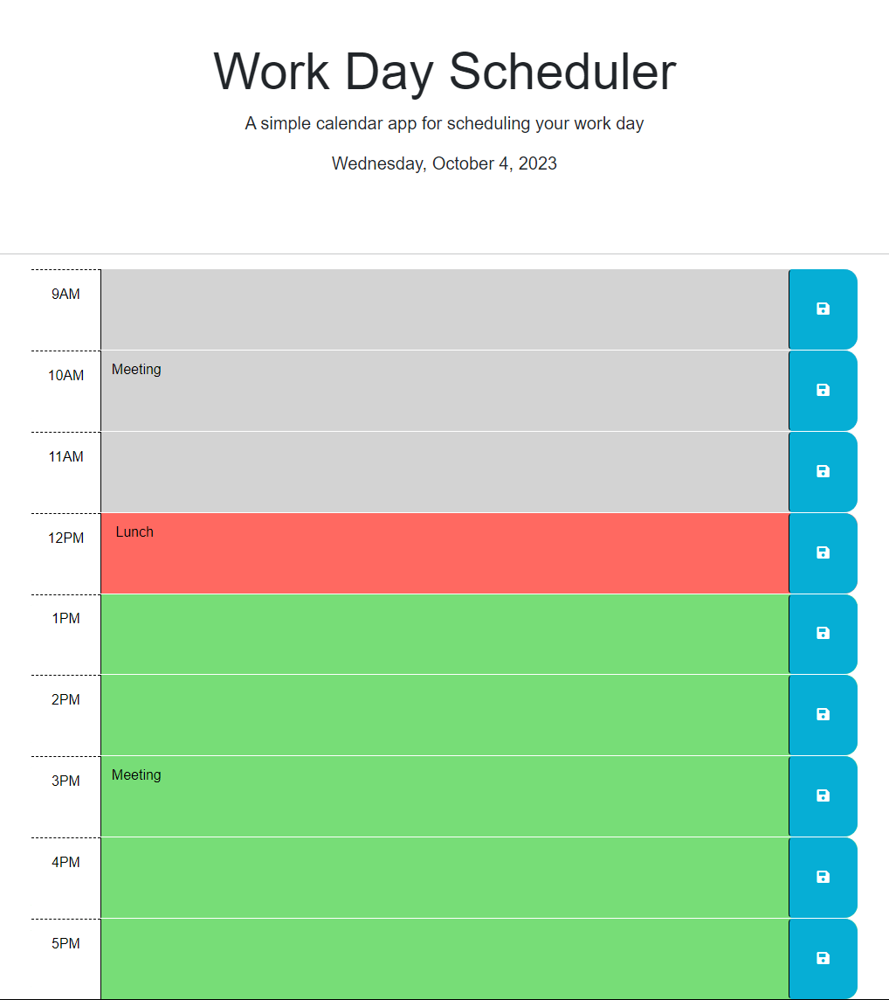

# Work Day Scheduler

## Description

A website that allows you to save events happening in your work day.

# Usage

To use this project, you may view the live website [here](https://ashoener.github.io/work-day-scheduler/).
Click on the event text box next to a time, and enter your event. Click the save icon on the right to save the event.
Events in the past will display as gray, the current event as red, and future events as green.

## License

Please refer to the [LICENSE](/LICENSE) in the repo.
